# AWS Strands Multi-Agent Database Provisioning Architecture

## System Overview

```mermaid
graph TB
    subgraph "Frontend Layer"
        UI[🌐 Liquid Glass UI<br/>React + TypeScript<br/>localhost:3000]
        NAV[📱 Navigation<br/>Strands Demo Page]
        SCENARIOS[📋 Predefined Scenarios<br/>E-commerce | Analytics | Microservices]
    end

    subgraph "API Gateway Layer"
        API[🔌 API Service<br/>Centralized HTTP Client<br/>CORS Enabled]
        ENDPOINTS[🛣️ REST Endpoints<br/>/strands/analyze<br/>/strands/approve<br/>/strands/sessions]
    end

    subgraph "Multi-Agent Orchestration Layer"
        ORCH[🎭 Strands Orchestrator<br/>Agent Coordination<br/>Session Management]
        
        subgraph "Specialized DBA Agents"
            WA[🔍 Workload Analyzer<br/>Query Patterns<br/>OLTP/OLAP Detection]
            CA[💰 Cost Optimizer<br/>TCO Analysis<br/>Aurora vs RDS vs EC2]
            SA[🔒 Security Analyst<br/>Compliance Frameworks<br/>PCI-DSS | SOX | HIPAA]
            PA[⚡ Performance Engineer<br/>Instance Sizing<br/>Connection Pooling]
            AA[🏗️ Architecture Specialist<br/>Engine Selection<br/>HA Design]
        end
    end

    subgraph "AI/ML Layer"
        BEDROCK[🧠 AWS Bedrock<br/>Claude 3.5 Sonnet<br/>Real AI Reasoning]
        MCP[🔧 Model Context Protocol<br/>Tool Integration<br/>Agent Communication]
    end

    subgraph "Backend Services"
        MCPS[🐳 MCP Server<br/>FastAPI + Python<br/>localhost:5001]
        SESSIONS[💾 Session Storage<br/>In-Memory Dict<br/>Agent Results]
        DEVFEED[📡 Dev Feed<br/>Real-time Updates<br/>Progress Tracking]
    end

    subgraph "Data Layer"
        POSTGRES[(🐘 PostgreSQL<br/>Primary Database<br/>localhost:5432)]
        MYSQL[(🐬 MySQL<br/>Secondary Database<br/>localhost:3306)]
        SQLITE[(📁 SQLite<br/>Lightweight DB<br/>File-based)]
    end

    subgraph "Infrastructure Layer"
        DOCKER[🐳 Docker Containers<br/>Service Isolation<br/>Hot Reloading]
        NGINX[🌐 Nginx Proxy<br/>Load Balancing<br/>Production Mode]
    end

    %% Frontend Connections
    UI --> NAV
    NAV --> SCENARIOS
    UI --> API

    %% API Layer Connections
    API --> ENDPOINTS
    ENDPOINTS --> MCPS

    %% Orchestration Flow
    MCPS --> ORCH
    ORCH --> WA
    ORCH --> CA
    ORCH --> SA
    ORCH --> PA
    ORCH --> AA

    %% AI Integration
    WA --> BEDROCK
    CA --> BEDROCK
    SA --> BEDROCK
    PA --> BEDROCK
    AA --> BEDROCK
    BEDROCK --> MCP

    %% Backend Services
    ORCH --> SESSIONS
    MCPS --> DEVFEED
    MCPS --> POSTGRES
    MCPS --> MYSQL
    MCPS --> SQLITE

    %% Infrastructure
    MCPS --> DOCKER
    UI --> DOCKER
    DOCKER --> NGINX

    %% Styling
    classDef frontend fill:#e1f5fe,stroke:#01579b,stroke-width:2px
    classDef api fill:#f3e5f5,stroke:#4a148c,stroke-width:2px
    classDef agents fill:#e8f5e8,stroke:#1b5e20,stroke-width:2px
    classDef ai fill:#fff3e0,stroke:#e65100,stroke-width:2px
    classDef backend fill:#fce4ec,stroke:#880e4f,stroke-width:2px
    classDef data fill:#e0f2f1,stroke:#004d40,stroke-width:2px
    classDef infra fill:#f1f8e9,stroke:#33691e,stroke-width:2px

    class UI,NAV,SCENARIOS frontend
    class API,ENDPOINTS api
    class ORCH,WA,CA,SA,PA,AA agents
    class BEDROCK,MCP ai
    class MCPS,SESSIONS,DEVFEED backend
    class POSTGRES,MYSQL,SQLITE data
    class DOCKER,NGINX infra
```

## Multi-Agent Execution Flow

```mermaid
sequenceDiagram
    participant UI as 🌐 Frontend UI
    participant API as 🔌 API Service
    participant ORCH as 🎭 Orchestrator
    participant WA as 🔍 Workload Agent
    participant CA as 💰 Cost Agent
    participant SA as 🔒 Security Agent
    participant PA as ⚡ Performance Agent
    participant AA as 🏗️ Architecture Agent
    participant BEDROCK as 🧠 AWS Bedrock
    participant HUMAN as 👤 Human Approver

    UI->>API: POST /strands/analyze
    API->>ORCH: Database Request
    
    Note over ORCH: Phase 1: Workload Analysis
    ORCH->>WA: Analyze Requirements
    WA->>BEDROCK: AI Analysis Request
    BEDROCK-->>WA: Workload Insights
    WA-->>ORCH: Workload Results
    
    Note over ORCH: Phase 2: Parallel Agent Execution
    par Parallel Analysis
        ORCH->>CA: Cost Analysis + Context
        CA->>BEDROCK: Cost Optimization
        BEDROCK-->>CA: Cost Recommendations
        CA-->>ORCH: Cost Results
    and
        ORCH->>SA: Security Analysis + Context
        SA->>BEDROCK: Compliance Analysis
        BEDROCK-->>SA: Security Requirements
        SA-->>ORCH: Security Results
    and
        ORCH->>PA: Performance Analysis + Context
        PA->>BEDROCK: Performance Modeling
        BEDROCK-->>PA: Instance Recommendations
        PA-->>ORCH: Performance Results
    end
    
    Note over ORCH: Phase 3: Architecture Synthesis
    ORCH->>AA: Synthesize All Results
    AA->>BEDROCK: Architecture Design
    BEDROCK-->>AA: Final Architecture
    AA-->>ORCH: Architecture Results
    
    Note over ORCH: Phase 4: Recommendation Generation
    ORCH->>ORCH: Synthesize Final Recommendation
    ORCH-->>API: Multi-Agent Results
    API-->>UI: Analysis Complete
    
    Note over UI: Human-in-the-Loop
    UI->>HUMAN: Review Recommendation
    HUMAN->>UI: Approve/Reject
    UI->>API: POST /strands/approve
    API->>ORCH: Provision Resources
    ORCH-->>UI: Provisioning Complete
```



## Agent Specialization Matrix


## Technology Stack Architecture


## Data Flow Architecture

```mermaid
flowchart TD
    subgraph "📱 User Interface Layer"
        SCENARIOS[Predefined Scenarios<br/>E-commerce | Analytics | Microservices]
        FORM[Request Form<br/>Team, Application, Requirements]
        PROGRESS[Progress Tracking<br/>Real-time Status Updates]
        RESULTS[Multi-Agent Results<br/>Recommendations & Metrics]
    end

    subgraph "🔄 Processing Pipeline"
        VALIDATE[Request Validation<br/>Schema Checking]
        SESSION[Session Creation<br/>Unique ID Generation]
        ORCHESTRATE[Agent Orchestration<br/>Parallel Execution]
        SYNTHESIZE[Result Synthesis<br/>Final Recommendation]
    end

    subgraph "🤖 Agent Execution Context"
        CONTEXT[Shared Context<br/>Agent-to-Agent Data]
        PARALLEL[Parallel Processing<br/>Cost | Security | Performance]
        SEQUENTIAL[Sequential Dependencies<br/>Workload → Others → Architecture]
        TIMING[Execution Metrics<br/>Performance Tracking]
    end

    subgraph "💾 State Management"
        INMEMORY[In-Memory Sessions<br/>Active Analysis State]
        DEVUPDATES[Development Feed<br/>Real-time Progress]
        APIRESPONSE[Structured Responses<br/>JSON API Format]
        FRONTEND[Frontend State<br/>React Component State]
    end

    %% Data Flow
    SCENARIOS --> FORM
    FORM --> VALIDATE
    VALIDATE --> SESSION
    SESSION --> ORCHESTRATE
    ORCHESTRATE --> CONTEXT
    CONTEXT --> PARALLEL
    CONTEXT --> SEQUENTIAL
    PARALLEL --> SYNTHESIZE
    SEQUENTIAL --> SYNTHESIZE
    SYNTHESIZE --> TIMING
    TIMING --> INMEMORY
    INMEMORY --> DEVUPDATES
    INMEMORY --> APIRESPONSE
    APIRESPONSE --> FRONTEND
    FRONTEND --> PROGRESS
    FRONTEND --> RESULTS

    classDef ui fill:#e3f2fd,stroke:#1565c0
    classDef process fill:#f1f8e9,stroke:#558b2f
    classDef agent fill:#fce4ec,stroke:#c2185b
    classDef state fill:#fff3e0,stroke:#f57c00

    class SCENARIOS,FORM,PROGRESS,RESULTS ui
    class VALIDATE,SESSION,ORCHESTRATE,SYNTHESIZE process
    class CONTEXT,PARALLEL,SEQUENTIAL,TIMING agent
    class INMEMORY,DEVUPDATES,APIRESPONSE,FRONTEND state
```

## Key Architectural Principles

### 🎯 **Multi-Agent Orchestration**
- **Specialized Agents**: Each agent focuses on specific DBA concerns
- **Parallel Execution**: Cost, Security, and Performance agents run simultaneously
- **Context Sharing**: Agents share analysis results for informed decisions
- **Orchestrated Synthesis**: Architecture agent combines all insights

### 🔄 **Asynchronous Processing**
- **Non-blocking Operations**: Python AsyncIO for concurrent agent execution
- **Real-time Updates**: WebSocket-like progress tracking via polling
- **Session Management**: Stateful analysis sessions with unique identifiers
- **Error Handling**: Graceful degradation with fallback responses

### 🛡️ **Enterprise-Grade Features**
- **Human-in-the-Loop**: Approval gates for critical decisions
- **Audit Trail**: Complete analysis history and reasoning chains
- **Compliance Integration**: Built-in support for PCI-DSS, SOX, HIPAA
- **Cost Optimization**: TCO analysis with Reserved Instance recommendations

### 🚀 **Developer Experience**
- **Hot Reloading**: Instant feedback during development
- **Type Safety**: Full TypeScript and Python type annotations
- **API-First Design**: RESTful endpoints with OpenAPI documentation
- **Container Isolation**: Docker-based service separation

This architecture demonstrates a production-ready AWS Strands implementation with real multi-agent collaboration, specialized domain expertise, and enterprise-grade features for database provisioning automation.