# Demo Architecture Diagrams

This document contains comprehensive architecture diagrams for all three AI-powered demo flows in the SRE GenAI platform.

## 1. AWS Strands SQL Database Provisioning Flow

### High-Level Architecture
```mermaid
graph TB
    subgraph "Frontend (React)"
        UI[User Interface]
        FORM[Requirements Form]
        PROGRESS[Progress Tracker]
        APPROVAL[Human Approval]
        RESULTS[Results Display]
        TERRAFORM[Terraform Template]
    end
    
    subgraph "Backend API (FastAPI)"
        ENDPOINT[/strands/analyze]
        ORCHESTRATOR[Strands Orchestrator]
        APPROVAL_EP[/strands/approve]
        TF_GEN[Terraform Generator]
    end
    
    subgraph "AI Agents (5 Agents)"
        WA[Workload Analyzer]
        CA[Cost Analyzer]
        SA[Security Analyst]
        PA[Performance Engineer]
        AA[Architecture Specialist]
    end
    
    subgraph "AWS Bedrock"
        CLAUDE[Claude 3.5 Haiku]
    end
    
    subgraph "Generated Infrastructure"
        RDS[RDS/Aurora Cluster]
        KMS[KMS Encryption]
        SG[Security Groups]
        IAM[IAM Roles]
        CW[CloudWatch Monitoring]
    end
    
    UI --> FORM
    FORM --> ENDPOINT
    ENDPOINT --> ORCHESTRATOR
    
    ORCHESTRATOR --> WA
    ORCHESTRATOR --> CA
    ORCHESTRATOR --> SA
    ORCHESTRATOR --> PA
    ORCHESTRATOR --> AA
    
    WA --> CLAUDE
    CA --> CLAUDE
    SA --> CLAUDE
    PA --> CLAUDE
    AA --> CLAUDE
    
    ORCHESTRATOR --> PROGRESS
    PROGRESS --> APPROVAL
    APPROVAL --> APPROVAL_EP
    APPROVAL_EP --> TF_GEN
    TF_GEN --> RESULTS
    RESULTS --> TERRAFORM
    
    TERRAFORM -.-> RDS
    TERRAFORM -.-> KMS
    TERRAFORM -.-> SG
    TERRAFORM -.-> IAM
    TERRAFORM -.-> CW
```

### Detailed Agent Workflow


## 2. NoSQL Database Onboarding Flow

### High-Level Architecture
```mermaid
graph TB
    subgraph "Frontend (React)"
        UI2[User Interface]
        SCENARIOS[Scenario Selector]
        FORM2[Requirements Form]
        PROGRESS2[Progress Tracker]
        APPROVAL2[Human Approval]
        RESULTS2[Results Display]
        TERRAFORM2[Terraform Template]
    end
    
    subgraph "Backend API (FastAPI)"
        ENDPOINT2[/nosql/analyze]
        ORCHESTRATOR2[NoSQL Orchestrator]
        APPROVAL_EP2[/nosql/approve]
        TF_GEN2[NoSQL Terraform Generator]
    end
    
    subgraph "AI Agents (7 Agents)"
        WA2[Workload Analyzer]
        DS[Database Selector]
        CS[Cache Strategy]
        CO[Cost Optimizer]
        SC[Security & Compliance]
        PE[Performance Engineer]
        AS[Architecture Specialist]
    end
    
    subgraph "AWS Bedrock"
        CLAUDE2[Claude 3.5 Haiku]
    end
    
    subgraph "Generated NoSQL Stack"
        DYNAMO[DynamoDB Tables]
        REDIS[ElastiCache Redis]
        DOCDB[DocumentDB]
        KMS2[KMS Encryption]
        IAM2[IAM Roles & Policies]
        CW2[CloudWatch Logs]
    end
    
    UI2 --> SCENARIOS
    SCENARIOS --> FORM2
    FORM2 --> ENDPOINT2
    ENDPOINT2 --> ORCHESTRATOR2
    
    ORCHESTRATOR2 --> WA2
    ORCHESTRATOR2 --> DS
    ORCHESTRATOR2 --> CS
    ORCHESTRATOR2 --> CO
    ORCHESTRATOR2 --> SC
    ORCHESTRATOR2 --> PE
    ORCHESTRATOR2 --> AS
    
    WA2 --> CLAUDE2
    DS --> CLAUDE2
    CS --> CLAUDE2
    CO --> CLAUDE2
    SC --> CLAUDE2
    PE --> CLAUDE2
    AS --> CLAUDE2
    
    ORCHESTRATOR2 --> PROGRESS2
    PROGRESS2 --> APPROVAL2
    APPROVAL2 --> APPROVAL_EP2
    APPROVAL_EP2 --> TF_GEN2
    TF_GEN2 --> RESULTS2
    RESULTS2 --> TERRAFORM2
    
    TERRAFORM2 -.-> DYNAMO
    TERRAFORM2 -.-> REDIS
    TERRAFORM2 -.-> DOCDB
    TERRAFORM2 -.-> KMS2
    TERRAFORM2 -.-> IAM2
    TERRAFORM2 -.-> CW2
```

### NoSQL Specialized Flows

```mermaid
graph LR
    subgraph "Scenario Types"
        ECOM[🛒 E-commerce<br/>Multi-Database]
        DOC[📄 Document Store<br/>NoSQL Focus]
        MEM[⚡ In-Memory<br/>Ultra-Fast Cache]
        GAME[🎮 Gaming<br/>Real-time]
        IOT[📡 IoT Platform<br/>Time-series]
        SOCIAL[👥 Social Media<br/>Graph + Content]
    end
    
    subgraph "Database Recommendations"
        DYNAMO_REC[DynamoDB + Redis]
        DOCDB_REC[DocumentDB + ElastiCache]
        REDIS_REC[MemoryDB + DAX]
        TIMESTREAM[Timestream + DynamoDB]
        NEPTUNE[Neptune + ElastiCache]
    end
    
    subgraph "Terraform Templates"
        DYNAMO_TF[DynamoDB Stack Template]
        DOCDB_TF[DocumentDB Stack Template]
        MEMORY_TF[In-Memory Stack Template]
        TIMESERIES_TF[Time-series Stack Template]
        GRAPH_TF[Graph Database Template]
    end
    
    ECOM --> DYNAMO_REC --> DYNAMO_TF
    DOC --> DOCDB_REC --> DOCDB_TF
    MEM --> REDIS_REC --> MEMORY_TF
    GAME --> REDIS_REC --> MEMORY_TF
    IOT --> TIMESTREAM --> TIMESERIES_TF
    SOCIAL --> NEPTUNE --> GRAPH_TF
```


### NoSQL Agent Execution Flow


## 3. AWS Agent Core Incident Response Flow

### High-Level Architecture
```mermaid
graph TB
    subgraph "Frontend (React)"
        UI3[Incident Reporting UI]
        SCENARIOS3[Incident Scenarios]
        FORM3[Incident Details Form]
        PROGRESS3[Agent Execution Tracker]
        APPROVAL3[Execution Approval]
        RESULTS3[Response Plan Display]
    end
    
    subgraph "Backend API (FastAPI)"
        ENDPOINT3[/agentcore/analyze]
        ORCHESTRATOR3[Agent Core Orchestrator]
        EXECUTE_EP[/agentcore/execute]
    end
    
    subgraph "AI Agents (5 Agents)"
        IDA[Incident Detection Agent]
        RCA[Root Cause Analysis Agent]
        ARA[Automated Remediation Agent]
        COM[Communication Agent]
        PIA[Post-Incident Analysis Agent]
    end
    
    subgraph "AWS Bedrock"
        CLAUDE3[Claude 3.5 Haiku]
    end
    
    subgraph "Incident Response Actions"
        DETECT[Incident Classification]
        ANALYZE[Root Cause Analysis]
        REMEDIATE[Automated Remediation]
        COMMUNICATE[Stakeholder Notification]
        IMPROVE[Improvement Recommendations]
    end
    
    UI3 --> SCENARIOS3
    SCENARIOS3 --> FORM3
    FORM3 --> ENDPOINT3
    ENDPOINT3 --> ORCHESTRATOR3
    
    ORCHESTRATOR3 --> IDA
    ORCHESTRATOR3 --> RCA
    ORCHESTRATOR3 --> ARA
    ORCHESTRATOR3 --> COM
    ORCHESTRATOR3 --> PIA
    
    IDA --> CLAUDE3
    RCA --> CLAUDE3
    ARA --> CLAUDE3
    COM --> CLAUDE3
    PIA --> CLAUDE3
    
    ORCHESTRATOR3 --> PROGRESS3
    PROGRESS3 --> APPROVAL3
    APPROVAL3 --> EXECUTE_EP
    EXECUTE_EP --> RESULTS3
    
    IDA --> DETECT
    RCA --> ANALYZE
    ARA --> REMEDIATE
    COM --> COMMUNICATE
    PIA --> IMPROVE
```

### Agent Core Incident Response Workflow


### Incident Response Scenarios

```mermaid
graph LR
    subgraph "Incident Types"
        DB_OUT[🗄️ Database Outage<br/>P0 Critical]
        API_PERF[⚡ API Performance<br/>P1 High]
        INFRA[🏗️ Infrastructure<br/>P0 Critical]
    end
    
    subgraph "Detection Results"
        P0_CLASS[P0 Classification<br/>Immediate Escalation]
        P1_CLASS[P1 Classification<br/>High Priority]
        IMPACT[Impact Assessment<br/>User/Business Impact]
    end
    
    subgraph "Remediation Actions"
        AUTO_SCALE[Auto-scaling Triggers]
        RESTART[Service Restart]
        FAILOVER[Database Failover]
        TRAFFIC[Traffic Rerouting]
    end
    
    subgraph "Communication"
        INTERNAL[Internal Notifications<br/>Slack, Email, PagerDuty]
        EXTERNAL[External Communications<br/>Status Page, Customers]
        ESCALATION[Escalation Matrix<br/>Leadership, On-call]
    end
    
    DB_OUT --> P0_CLASS --> FAILOVER --> INTERNAL
    API_PERF --> P1_CLASS --> AUTO_SCALE --> INTERNAL
    INFRA --> P0_CLASS --> TRAFFIC --> EXTERNAL
    
    P0_CLASS --> ESCALATION
    P1_CLASS --> ESCALATION
```


## 4. Cross-Demo Architecture Integration

### Unified Platform Architecture


### Technology Stack Overview


## Key Architecture Principles

### 1. Multi-Agent Orchestration
- **Parallel Execution**: Agents run concurrently where possible for optimal performance
- **Context Sharing**: Agents share analysis results for informed decision-making
- **Dynamic Confidence**: AI-powered confidence scoring based on data quality

### 2. Human-in-the-Loop
- **Approval Gates**: Human approval required for high-risk actions
- **Transparency**: Full visibility into AI decision-making process
- **Override Capability**: Manual override options at critical decision points

### 3. Infrastructure-as-Code Generation
- **Production Ready**: Generated Terraform includes security, monitoring, and best practices
- **Customizable**: Templates adapt to specific requirements and constraints
- **Downloadable**: Users can copy or download templates for immediate use

### 4. Real-time Feedback
- **Live Progress**: Real-time agent execution tracking
- **Confidence Scoring**: Dynamic confidence levels based on analysis quality
- **Error Handling**: Graceful degradation with meaningful error messages

### 5. Scalable Architecture
- **Microservices**: Separate orchestrators for different use cases
- **Async Processing**: Non-blocking agent execution
- **Session Management**: Stateful workflows with session persistence
- **API-First**: RESTful APIs for all functionality

This architecture enables sophisticated AI-powered database and incident response workflows while maintaining human oversight and generating production-ready infrastructure code.