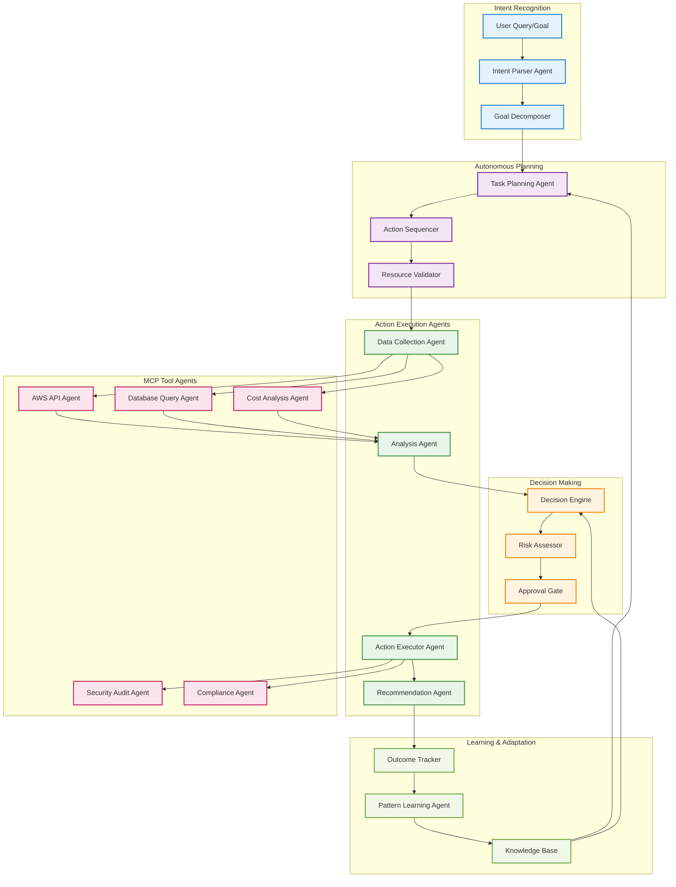

# Agentic AWS Inventory AI System

## Overview
Transform the current reactive chat system into an autonomous agent that can plan, execute, and learn from database inventory management tasks.

## Agentic Flow Architecture



## Agentic Capabilities

### 1. **Intent Recognition & Goal Decomposition**
```
User: "Optimize our database costs while maintaining performance"

Intent Parser → Identifies: COST_OPTIMIZATION + PERFORMANCE_MAINTENANCE
Goal Decomposer → Creates sub-goals:
  1. Analyze current database costs
  2. Identify performance requirements
  3. Find optimization opportunities
  4. Validate performance impact
  5. Execute approved changes
  6. Monitor outcomes
```

### 2. **Autonomous Task Planning**
```
Task Planner → Creates execution plan:
  Phase 1: Data Collection
    - Collect RDS instance data
    - Gather performance metrics
    - Analyze cost trends
  
  Phase 2: Analysis
    - Identify over-provisioned instances
    - Calculate Reserved Instance savings
    - Assess right-sizing opportunities
  
  Phase 3: Risk Assessment
    - Check production impact
    - Validate backup strategies
    - Assess downtime requirements
  
  Phase 4: Execution
    - Generate change scripts
    - Schedule maintenance windows
    - Execute approved changes
  
  Phase 5: Monitoring
    - Track performance metrics
    - Monitor cost changes
    - Learn from outcomes
```

### 3. **Multi-Agent Execution**
Each agent has specialized capabilities:

**Data Collection Agent:**
- Autonomously gathers AWS resource data
- Monitors real-time metrics
- Detects anomalies and changes

**Analysis Agent:**
- Performs complex data analysis
- Identifies patterns and trends
- Generates insights and recommendations

**Decision Engine:**
- Evaluates multiple options
- Considers risk vs. benefit
- Makes autonomous decisions within bounds

**Action Executor Agent:**
- Executes approved changes
- Handles rollback scenarios
- Coordinates with external systems

### 4. **Learning & Adaptation**
```
Outcome Tracker → Records:
  - Action taken: "Right-sized db.m5.2xlarge to db.m5.xlarge"
  - Result: "30% cost reduction, performance maintained"
  - User feedback: "Positive"

Pattern Learner → Identifies:
  - Similar workloads can be right-sized
  - Performance impact is minimal for this pattern
  - Cost savings are significant

Knowledge Base → Updates:
  - Add successful pattern to recommendations
  - Increase confidence in similar scenarios
  - Refine decision-making algorithms
```

## Implementation Strategy

### Phase 1: Agent Framework
1. **Create Agent Base Classes**
2. **Implement Intent Recognition**
3. **Build Task Planning Engine**
4. **Add Decision Making Logic**

### Phase 2: Specialized Agents
1. **AWS Resource Agents**
2. **Database Management Agents**
3. **Cost Optimization Agents**
4. **Security & Compliance Agents**

### Phase 3: Learning System
1. **Outcome Tracking**
2. **Pattern Recognition**
3. **Knowledge Base Updates**
4. **Continuous Improvement**

## Agentic Workflows

### Workflow 1: Proactive Database Health Check
```
Trigger: Daily schedule
Agent Flow:
1. Data Collection Agent → Scans all RDS instances
2. Analysis Agent → Identifies health issues
3. Decision Engine → Prioritizes issues by severity
4. Recommendation Agent → Suggests fixes
5. Approval Gate → Auto-approves low-risk fixes
6. Action Executor → Implements approved fixes
7. Outcome Tracker → Records results
```

### Workflow 2: Cost Optimization Campaign
```
Trigger: Monthly cost review
Agent Flow:
1. Cost Agent → Analyzes spending patterns
2. Task Planner → Creates optimization roadmap
3. Risk Assessor → Evaluates each opportunity
4. Decision Engine → Selects best options
5. Action Executor → Implements changes
6. Pattern Learner → Updates optimization strategies
```

### Workflow 3: Security Compliance Audit
```
Trigger: Compliance requirement
Agent Flow:
1. Security Agent → Scans for vulnerabilities
2. Compliance Agent → Checks against standards
3. Analysis Agent → Prioritizes findings
4. Recommendation Agent → Suggests remediation
5. Approval Gate → Routes for human approval
6. Action Executor → Implements fixes
7. Outcome Tracker → Validates compliance
```

## Benefits of Agentic Flow

### 🚀 **Autonomous Operation**
- Reduces manual intervention
- Operates 24/7 without human oversight
- Scales to handle large infrastructures

### 🧠 **Intelligent Decision Making**
- Learns from past actions
- Adapts to changing environments
- Makes context-aware decisions

### ⚡ **Proactive Management**
- Identifies issues before they impact users
- Prevents problems rather than reacting
- Optimizes continuously

### 🔄 **Continuous Improvement**
- Gets smarter over time
- Refines strategies based on outcomes
- Builds institutional knowledge

## Risk Mitigation

### 🛡️ **Safety Mechanisms**
- Human approval gates for high-risk actions
- Rollback capabilities for all changes
- Comprehensive logging and audit trails

### 🎯 **Bounded Autonomy**
- Clear limits on agent authority
- Risk-based approval workflows
- Override mechanisms for humans

### 📊 **Transparency**
- Explainable AI decisions
- Clear audit trails
- Real-time monitoring dashboards
```