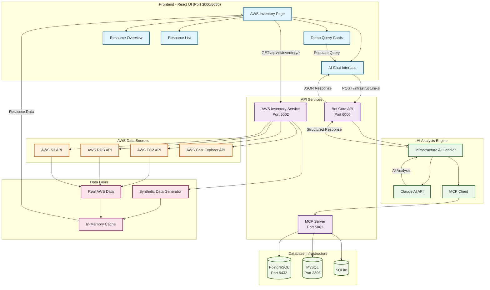

# AWS Inventory AI System Architecture

## System Overview

The AWS Inventory AI system is a comprehensive database inventory management platform that combines real-time AWS data collection, AI-powered analysis, and interactive chat interfaces to provide actionable insights for infrastructure teams.

## Architecture Diagram

## Component Details

### 1. Frontend Layer (React + TypeScript)
- **AWS Inventory Page**: Main interface with tabs (Overview, Resources, AI Chat)
- **AI Chat Interface**: Large chat area with textarea input and message history
- **Demo Query Cards**: Pre-built database-focused queries for quick access
- **Resource Views**: Tables and summaries of AWS resources

### 2. API Services Layer
- **Bot Core API (Port 6000)**: Handles AI chat requests and Claude integration
- **AWS Inventory Service (Port 5002)**: Fetches and processes AWS resource data
- **MCP Server (Port 5001)**: Model Context Protocol server for database operations

### 3. AI Analysis Engine
- **Claude AI**: Provides intelligent analysis of infrastructure data
- **Infrastructure AI Handler**: Processes queries and formats responses
- **MCP Client**: Interfaces with database tools and utilities

### 4. Data Flow

#### Query Processing Flow:
1. User types query in chat interface
2. Frontend sends POST to `/infrastructure-ai` endpoint
3. Bot Core processes query with context data
4. Infrastructure AI Handler enriches query with AWS resource data
5. Claude AI analyzes data and generates insights
6. Response flows back through the chain to the UI

#### Data Collection Flow:
1. AWS Inventory Service calls AWS APIs (EC2, RDS, S3, Cost Explorer)
2. Real data is processed and cached
3. Synthetic data generator creates realistic demo data when APIs unavailable
4. Combined data is served to frontend for display

### 5. Database Integration
- **PostgreSQL**: Primary database for complex queries
- **MySQL**: Secondary database for compatibility testing
- **SQLite**: Lightweight database for development

## Key Features

### Database-Focused Analysis
- **Engine Analysis**: MySQL, PostgreSQL, Oracle, SQL Server, MariaDB
- **Version Compliance**: Identifies outdated database versions
- **Security Assessment**: Encryption, public access, Multi-AZ configuration
- **Cost Optimization**: Reserved Instance opportunities, right-sizing
- **Performance Analysis**: Instance classes, storage types, IOPS configuration

### AI-Powered Insights
- **Natural Language Queries**: Plain English database questions
- **Contextual Analysis**: Considers environment, team, application context
- **Actionable Recommendations**: Specific steps for optimization
- **Compliance Reporting**: Security and best practice adherence

### Real-time Data
- **Live AWS Integration**: Fetches current resource states
- **Cost Analysis**: Monthly cost breakdowns and trends
- **Resource Relationships**: Application and team mappings
- **Multi-region Support**: Cross-region resource visibility

## Technology Stack

### Frontend
- **React 18** with TypeScript
- **Tailwind CSS** for styling
- **Vite** for development and building

### Backend
- **FastAPI** (Python) for REST APIs
- **Claude AI** integration for analysis
- **AWS SDK** for resource data collection

### Infrastructure
- **Docker** containerization
- **Nginx** reverse proxy
- **Multi-database** support (PostgreSQL, MySQL, SQLite)

## Security & Compliance

### Data Protection
- **No persistent storage** of sensitive AWS data
- **In-memory caching** for performance
- **Synthetic data** for demo environments

### Access Control
- **API-based architecture** for controlled access
- **Environment separation** (production, staging, development)
- **Audit logging** for compliance tracking

## Scalability

### Horizontal Scaling
- **Microservices architecture** allows independent scaling
- **Stateless APIs** for load balancing
- **Container-based deployment** for easy scaling

### Performance Optimization
- **Data caching** reduces API calls
- **Async processing** for large datasets
- **Efficient data structures** for fast queries

This architecture provides a robust, scalable platform for database inventory management with AI-powered insights and real-time AWS integration.